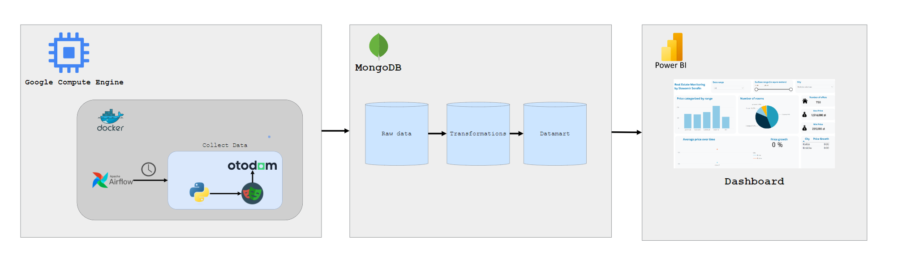

# Real Estate Monitoring

Welcome to the Real Estate Monitoring project! This project aims to provide a comprehensive solution for monitoring real estate properties and their market trends. Whether you are a real estate investor, agent, or simply interested in the market, this project will provide you with valuable insights and tools.

## Features

- Property tracking: Easily track and monitor properties of interest, including their location, price, and key details.
- Market analysis: Access detailed market analysis reports to understand trends, pricing patterns, and investment opportunities.
- Data visualization: Visualize real estate data through interactive charts and maps for better analysis and decision-making.
- User-friendly interface: Enjoy a clean and intuitive interface that makes it easy to navigate and use the application.

## Data flow
Here is a visual representation of the data flow in the Real Estate Monitoring project:



## Tech stack
The Real Estate Monitoring project utilizes the following technology stack:
- Containerization: Docker for containerizing the Python app.
- Data scraping: Playwright + BeautifoulSoup
- Task schedular: Apache airlow
- Database: MongoDB for storing real estate data.
- Data visualization: Power BI for creating insightful data visualizations.
- Version control: Git for managing the source code.
- Deployment: Google Cloud Platform Compute Engine
- Unit testing: pyTest

## Explore PowerBI dashboard
Power BI is regarded as the final stage and output of the application, delivering insightful data visualizations and comprehensive business intelligence.

## Getting Started

To get started with the Dockerized Python app, follow these steps:

1. Install Docker: If you don't have Docker installed on your machine, you can download and install it from the official Docker website.

2. Clone the repository: Open your terminal and navigate to the directory where you want to clone the repository. Then, run the following command to clone the repository:

    ```
    git clone https://github.com/your-username/your-repository.git
    ```

3. Build the Docker image: Once the repository is cloned, navigate to the project's root directory and run the following command to build the Docker image:

    ```
    docker build -t your-image-name .
    ```

4. Run the Docker container using Docker Compose: Instead of running the Docker container directly, you can use Docker Compose to simplify the process. 

    Run the following command to start the Docker container:

    ```
    docker-compose up
    ```

    This command will build the Docker image and start the container, mapping port 8080 of the container to port 8080 of your local machine. You can change the port number if needed.

5. Access the app: Open your web browser and navigate to `http://localhost:8080` to access the Dockerized Python app.

## Important Notes

Here are some important notes to keep in mind while using the Real Estate Monitoring project:
To ensure full access to the mounted folder on your machine, the user ID on your machine should match the user ID of the airflow user in the dockerized app. You can find your user ID by running the command `id -u $USER`.

- To simplify the process, SQLite is used as a database backend and `SequentialExecutor` as a worker. Use the tools of your choice to customize.
- Keep in mind that the project requires a `.env` file with the following defined environment variables: `AIRFLOW_USER_USERNAME`, `AIRFLOW_USER_PASSWORD`, `AIRFLOW_USER_FIRSTNAME`, `AIRFLOW_USER_LASTNAME`, `AIRFLOW_USER_EMAIL`.
- Include a `certs` directory with the following structure:
```
certs
├── datamart
│   ├── svc_003.pem
│   └── svc_004.pem
├── raw
│   └── svc_001.pem
└── transformations
    └── svc_002.pem
```
- Please be informed that the project also requires a connection to a MongoDB cluster, which needs to be set up individually by the user.


By following these notes, you can make the most out of the Real Estate Monitoring project and enhance your real estate endeavors.


That's it! You now have the Dockerized Python app up and running on your local machine. You can explore and interact with the app using your web browser.


## Contributing

We welcome contributions from the community to make the Real Estate Monitoring project even better. If you have any ideas, bug reports, or feature requests, please open an issue or submit a pull request. Let's collaborate and build a powerful real estate monitoring tool together!

## License

This project is licensed under the MIT License. See the [LICENSE](LICENSE) file for more information.
